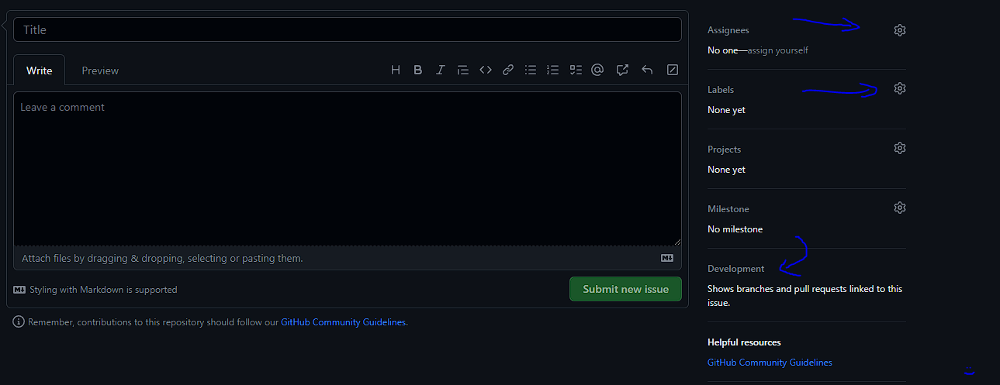

# Guide to Git & GitHub
_Scroll to the bottom for extra commands you might need_

> __Important:__ Stay up to date on the GitHub repository and communicate changes with the group :)

## GitHub Workflow
This is the typical workflow you will encounter when using GitHub. Commands in this section go in order of the workflow.

### __When starting and working on new changes:__
__- Pulling from GitHub__

Before you start on a new branch, you should make sure your local master branch and the branch you are working on are up to date.
```
git pull
```
__- Checking Repo Status__

Run this command regularly/daily to check and see if there are changes made to the repository that you need to pull locally. 

__Note:__ You cannot push any changes without your local branches being up to date with the remote master branch.
```
git status
```

__- Creating a new branch and switching to it__

This is done when you start working on a new change
```
git checkout -b <branch_name>
```

### __To push changes:__
__- Run Black and Pylint__

Run the following commands individually in the order displayed
> Refer to the poetry_setup markdown file for more details
```
poetry run black ./src
poetry run pylint --recursive=y .
```

__- Stage changed files__

_You can specify what files need to be staged. The '.' signifies adding all files that have been changed_
```
git add .
```
__- Commiting changes__

Write a brief message to describe what you did. __Note:__ Commits should be frequent on branches to show that an intended change is working. You should typically have a few commits for each branch that you push!
```
git commit -m "<message goes here>"
```
__- Pushing changes__

This pushes your local branch that you just finished working on to the remote repository on GitHub
```
git push origin <branch-name>
OR
git push
```
_*Second should only work when pushing to a branch that already exists remotely_

### __Making a PR:__ 
1. Go to the repository on GitHub and click on the __Compare & pull request button__. Refresh the page if you already have the repository up. It should look something like this:


2. Now do the following to complete a PR:
    - Add a title and comment on all the changes you made.
    - Add everyone on the team as a reviewer.
    - Optionally add labels to your PR.
    - Lastly, click on the __Create pull request__ button.

> __Keep in mind:__ If you have problems or suggestions by others for refactoring code you can go back to your code, make changes, and then *push the changes. This will automatically update your pr and show the new commits that you made.

3. Once all tests pass and you have received sufficient reviews, go ahead and merge the pull request!

### __Creating an Issue:__ 
1. Go to the Issues tab near the top of the page.
2. Click on the __New Issue__ button.
3. Now do the following to publish an issue:
    - Add a title and comment on the issue you're having.
    - Add everyone on the team as a reviewer.
    - Add labels to your issue.
    - Optionally, you can directly link the issue to a PR under the 'Development' section.
        - This can help other easily identify the code associated with your issue
    - Lastly, click on the __Submit new issue__ button.
    
    


## Other GitHub Commands
__Listing branches ->__
```
git branch
```
__Switching branches ->__
```
git checkout <branch name>
```
__Deleting branches ->__
```
git branch -d <branch name>
```
__Renaming branches ->__
```
git branch -m <old branch name> <new branch name>
```
__Stashing changes ->__
```
git stash
```
__Clearing stash ->__
```
git stash clear
```