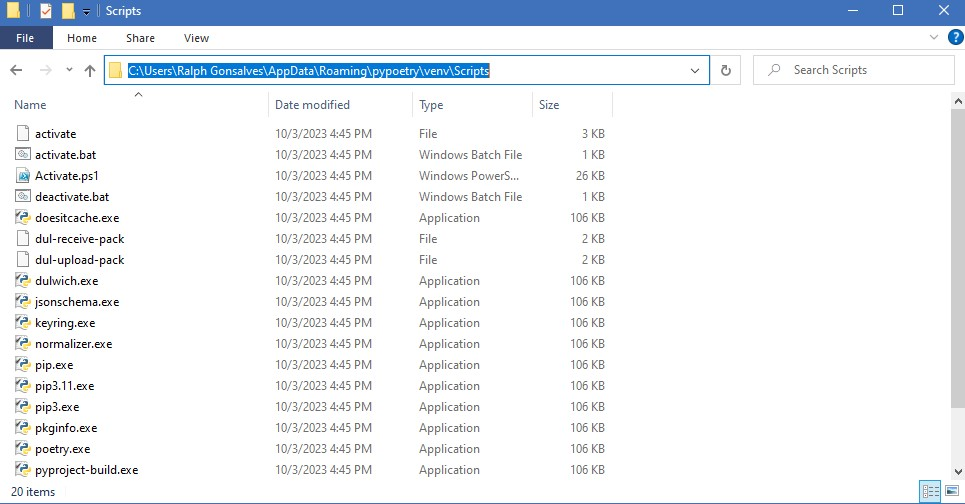
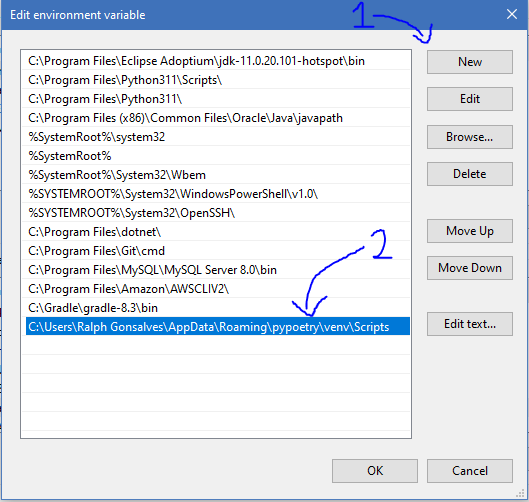

# Guide to Poetry
_This guide is going to help you set up poetry and when to use poetry_

Note: This is only for Windows users

## Documentation
- [Poetry](https://python-poetry.org/)
- [Black](https://black.readthedocs.io/en/stable/#)
- [Pylint](https://pylint.readthedocs.io/en/stable/#)


## Installation
1. Open windows powershell by searching for 'powershell' in the windows search bar
2. With powershell open, go ahead and copy the following line of code into the terminal and hit enter to install poetry
```
(Invoke-WebRequest -Uri https://install.python-poetry.org -UseBasicParsing).Content | py -
```
3. Now we need to set up the PATH environmental variable to be able to read poetry commands. To do this open the windows search bar and type in 'environment variables'.
4. Once system properties has popped up, click on the __Environmental Variables__ button 

5. Now click on __Path__ located under __System variables__ and then click on the __Edit__ button 
6. A new window should pop up showing all your path environmental variables. Before we move forward and create a new path, open your file explorer and go to the location of the poetry scripts. It should look something like shown below, and copy that path.
```
C:\Users\<username>\AppData\Roaming\pypoetry\venv\Scripts
```
_Here is what the folder looks like. Copy the path at the top highlighted in blue_

>__Note:__ Make sure you can see hidden items, otherwise you will not be able to see the AppData folder. To see hidden items go to 'View' and check the Hidden items box (Hover over __Show__ in Windows 11).

7. Now, go back to the 'Edit environment variable' window. Click on the __New__ button and paste the path you just copied.
8. Click 'OK' 3 times to exit the environment variable window.
9. Go back to your powershell window and type in
```
poetry --version
```
You should receive a response from the terminal indicating that you have installed poetry version 1.6.1. If so, you are all set to move onto the next section :)

> __IF__ for some reason you encounter an error when checking the version, try restarting and then retrying the command in powershell. If that does not work, contact me (Ralph)

## Using Poetry
Now that you've installed poetry, you need to understand how to use it for the project.

Poetry is a package management system that bundles all libraries/dependencies used in the project. Anyone accessing the code can easily install required dependencies making our train application easily portable and useable for us collaborators and other coders.

Now all of us are familiar with pip, or package installers, that are used to install dependencies. Poetry is be a clean and alternate way to do what pip does.

The following are some important commands that you guys will be using:

* __Install all dependencies used in the application:__
```
poetry install
```
_Each time you pull from github, you need to make sure that you have locally installed all the dependencies in the pyproject.toml folder. __Note: There is no need to run this command if there have been no updates to the pyproject.toml file___

* __Add a dependency to the project:__
```
poetry add <dependency>
```
_When adding new dependencies, run this command to add it to the project and to a virtual environment locally. You are now able to use the dependency and the dependency will automatically be added to the pyproject.toml file._

## __Important__
The following dependencies are used to maintain a consistent style and codinf standard. You __must__ run these exact commands before pushing your code!

* __Running Black:__
```
poetry run black ./src
```
_This is our styler. Don't be afraid if it changes how your code looks. Refer to the documentation for specifics on black styling._

* __Running Pylint:__
```
poetry run pylint --recursive=y .
```
_This is our linter. It checks to see if you named variables correctly and wrote good doc style comments among other things._
> __Note:__ If you do not know how to fix an error, refer to the pylint documentation (search up error based on code).
